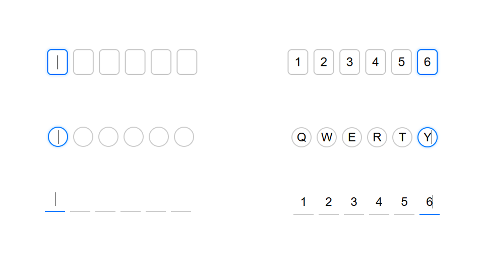

# SnapOTP jQuery Plugin

SnapOTP is a lightweight and customizable jQuery plugin to create elegant multi-field OTP (One-Time Password) input interfaces. It supports features like auto-focus, keyboard navigation, smart paste handling, reset control, and event callbacks — making it perfect for authentication and verification workflows.

 <!-- Optional: Replace or remove if not available -->

---

## 🚀 Features

- 🔢 Configurable OTP digit length
- 🎯 Auto-focus to next field
- 🔄 Smart paste support (entire OTP from clipboard)
- 🎹 Keyboard navigation with Arrow keys & Backspace
- 🔁 Reset method (`resetSnapOTP`)
- 🔔 Events: `onComplete`, `onChange`, `onEnter`
- 🧑‍🎨 Input styling via `data-style` attribute (`box`, `underline`, `circle`)

---

## 📦 Installation

### 1. Include jQuery

```html
<script src="https://code.jquery.com/jquery-3.6.0.min.js"></script>
```

### 2. Include SnapOTP JS and CSS

```html
<link rel="stylesheet" href="snapotp.css">
<script src="snapotp.js"></script>
```

---

## 🧑‍💻 Usage

### HTML

```html
<div id="otp"></div>
```

### JavaScript

```javascript
$('#otp').snapOTP({
  digits: 6,
  onComplete: function (code) {
    console.log('OTP Entered:', code);
  },
  onChange: function (code) {
    console.log('OTP Changed:', code);
  },
  onEnter: function (code) {
    alert('Enter pressed: ' + code);
  },
  type: 'number', // or 'text'
  style: 'box' // box | underline | circle
});
```

---

## 🧪 Methods

### Reset OTP inputs

```javascript
$('#otp').resetSnapOTP();
```

This will clear all fields and focus on the first input.


### Get Value

```javascript
$('#otp').getValue();
```


This will clear all fields and focus on the first input.
---

## 🎨 Styling

SnapOTP supports basic styling using the `data-style` attribute on the container:

```html
<div id="otp" data-style="underline"></div>
```

Available styles:
- `box` (default)
- `underline`
- `circle`

Customize styles in your CSS based on the `[data-style]` attribute.

---

## 📁 File Structure

```
/snapotp-jquery
│
├── snapotp.js       # Plugin logic
├── snapotp.css      # Default styles (extendable)
```

---

## 👨‍🎨 Author

**Nitin Rathod**  
🔗 GitHub: [@nitinramrathod](https://github.com/nitinramrathod)

---

## 📄 License

Licensed under the MIT License.  
Feel free to use, modify, and distribute with attribution.

---

## 🌍 Repository

**GitHub:** [https://github.com/nitinramrathod/snapotp-jquery](https://github.com/nitinramrathod/snapotp-jquery)
